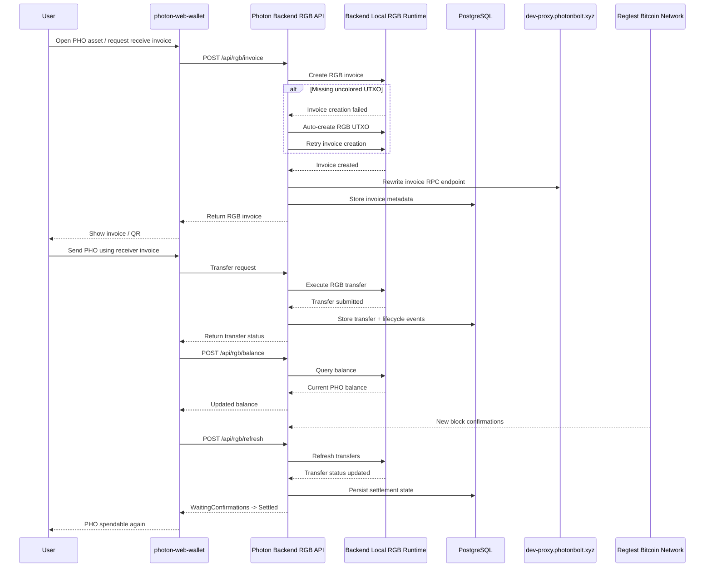

# Agent-Base Transfer of PHO

Based on the current `AGENTS.md` state, the `PHO` transfer flow is backend-driven, with `photon-web-wallet` acting mainly as the client UI.

## Transfer Steps

1. The user opens `photon-web-wallet` and selects the `PHO` asset.
2. The receiver generates an RGB invoice through the wallet UI.
3. The wallet sends that request to the backend at `POST /api/rgb/invoice`.
4. The backend uses its local RGB wallet runtime to create the invoice.
5. If invoice creation fails because there is no available uncolored UTXO, the backend automatically creates RGB UTXOs and retries.
6. The backend rewrites the invoice to use the public proxy RPC endpoint: `rpcs://dev-proxy.photonbolt.xyz/json-rpc`.
7. The backend returns the invoice to the wallet.
8. The sender uses that invoice in the wallet transfer flow.
9. The wallet sends the transfer request to the backend, which performs the RGB transfer using the backend-held wallet runtime.
10. The backend records invoice and transfer state in PostgreSQL tables such as `rgb_invoices`, `rgb_transfers`, `transfer_events`, and related wallet tables.
11. The wallet queries balances through `POST /api/rgb/balance`, so the displayed PHO balance comes from the backend, not local wallet-only state.
12. The wallet or backend triggers refresh through `POST /api/rgb/refresh` to update transfer state.
13. After enough regtest block confirmations are mined, refresh moves the transfer from `WaitingConfirmations` to `Settled`.
14. Once settled, the transferred PHO becomes spendable again.

## Architectural Meaning

- `photon-web-wallet` is currently the frontend client.
- The backend is the effective RGB wallet owner and executor.
- PostgreSQL is the persistence layer for wallet, invoice, and transfer lifecycle.
- Settlement depends on block confirmations plus refresh.

## Mermaid Diagram

## Important Note

This reflects the current regtest implementation described in `AGENTS.md`, not a future fully self-custodial wallet flow.
