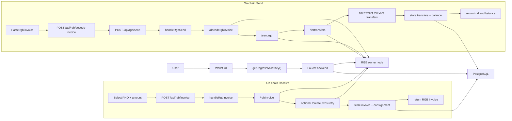

# Flow01-Onchain: PHOTON RGB On-Chain Flow From Code

This document is based on:

- `photon-web-wallet/src/App.tsx`
- `photon-web-wallet/src/utils/rgb-wallet.ts`
- `faucet/server.js`

## Components Used In This Flow

1. `photon-web-wallet`
   Creates RGB invoices, decodes RGB invoices, and sends RGB assets.

2. Faucet backend
   Handles:
   - `POST /api/rgb/invoice`
   - `POST /api/rgb/decode-invoice`
   - `POST /api/rgb/send`
   - `POST /api/rgb/refresh`

3. RGB owner node
   Used for:
   - `/rgbinvoice`
   - `/decodergbinvoice`
   - `/sendrgb`
   - `/listassets`
   - `/listtransfers`
   - `/refreshtransfers`
   - `/createutxos`

4. PostgreSQL
   Used to persist wallet-scoped invoice and transfer state.

## Shared Setup

Before the wallet sends PHO requests:

1. The wallet builds a backend identity with `getRegtestWalletKey()`.
2. It sends that key in `x-photon-wallet-key`.
3. The backend calls `ensureWallet(...)` to scope the request to one logical wallet.
4. The wallet resolves the selected local asset id such as `pho` to its RGB contract id before requesting invoice creation or send.

## Flow A: Receive PHO With An RGB Invoice

1. The user opens the RGB receive screen.
2. The wallet resolves the selected PHO asset to its RGB contract id from local storage.
3. The wallet calls `createRegtestRgbInvoice(...)`.
4. The wallet sends `POST /api/rgb/invoice` with:
   - `assetId`
   - `amount`
   - `openAmount`
   - header `x-photon-wallet-key`
5. The backend handler `handleRgbInvoice` validates the request.
6. The backend creates an RGB node payload with:
   - `min_confirmations: 1`
   - `asset_id`
   - `assignment` or `null`
   - `duration_seconds: 86400`
   - `witness: false`
7. The backend calls `/rgbinvoice` on the owner RGB node.
8. If the node has no uncolored UTXOs, the backend calls `/createutxos` and retries `/rgbinvoice` once.
9. The backend rewrites the invoice transport endpoint to the public proxy endpoint.
10. The backend syncs the asset into `wallet_assets` via `/listassets`.
11. The backend stores invoice metadata in `rgb_invoices`.
12. The backend creates or updates a `consignment_records` row for the invoice recipient id.
13. The backend returns the invoice to the wallet.
14. The wallet displays the invoice and QR code.

## Flow B: Send PHO With An RGB Invoice

1. The user pastes an `rgb:` invoice in the wallet send screen.
2. The wallet detects an RGB on-chain route.
3. The wallet calls `decodeRegtestRgbInvoice(...)`.
4. The wallet sends `POST /api/rgb/decode-invoice`.
5. The backend forwards the request to `/decodergbinvoice` on the owner RGB node.
6. The decoded payload gives the wallet:
   - `asset_id`
   - `recipient_id`
   - assignment value
   - transport endpoints
7. The wallet moves to confirmation and later calls `sendRegtestRgbInvoice(...)`.
8. The wallet sends `POST /api/rgb/send` with:
   - `invoice`
   - `feeRate`
   - `minConfirmations`
   - header `x-photon-wallet-key`
9. The backend handler `handleRgbSend` decodes the invoice again via `/decodergbinvoice`.
10. The backend validates:
   - `assetId`
   - `recipientId`
   - `amount`
   - transport endpoint
11. The backend syncs the asset into `wallet_assets`.
12. The backend records a `transfer_events` row with `rgb_send_requested`.
13. The backend calls `/sendrgb` on the owner RGB node with:
   - `donation: false`
   - `fee_rate`
   - `min_confirmations`
   - a `recipient_map` for the PHO asset
   - `skip_sync: false`
14. The RGB node returns a Bitcoin `txid`.
15. The backend calls `/listtransfers`.
16. The backend filters those transfers with `isTransferRelevantToWallet(...)`.
17. The backend stores relevant rows in `rgb_transfers`.
18. The backend reconciles invoice and consignment state.
19. The backend derives a wallet-scoped balance and stores it.
20. The backend records another transfer event: `rgb_send_broadcast`.
21. The backend returns:
   - `txid`
   - decoded invoice
   - wallet-scoped balance
   - matched transfer row
22. The wallet shows the send-success screen.
23. The wallet later refreshes balances and UTXO views.

## Post-Send Refresh

After RGB send success, the wallet schedules a delayed refresh:

1. `handleRefreshBalance()`
2. `handleViewUtxos()`

That refresh path eventually re-queries the backend and re-syncs wallet state.

## Mermaid Diagram

