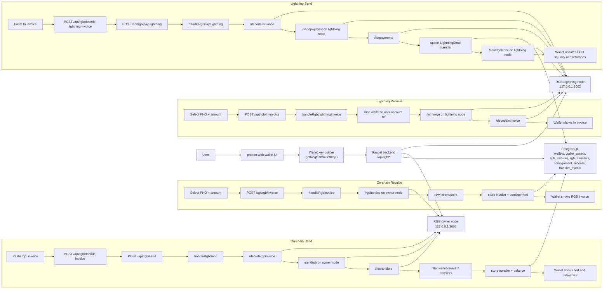

# Flow01: PHOTON Asset Transfer Flow From Code

This document is based on the current code in:

- `photon-web-wallet/src/App.tsx`
- `photon-web-wallet/src/utils/rgb-wallet.ts`
- `faucet/server.js`

It does not rely on `AGENTS.md`.

## Scope

This flow describes how the web wallet transfers PHO and other RGB assets in the current regtest implementation.

There are two transfer paths in code:

1. RGB on-chain transfer
2. RGB Lightning transfer

There is also a shared wallet identity and sync layer used by both.

## Main Components

1. `photon-web-wallet`
   The browser extension UI. It creates invoices, decodes invoices, sends PHO, refreshes balances, and displays history.

2. Faucet backend
   The HTTP API used by the wallet. The wallet calls endpoints such as:
   - `POST /api/rgb/invoice`
   - `POST /api/rgb/ln-invoice`
   - `POST /api/rgb/decode-invoice`
   - `POST /api/rgb/decode-lightning-invoice`
   - `POST /api/rgb/send`
   - `POST /api/rgb/pay-lightning`
   - `POST /api/rgb/balance`
   - `POST /api/rgb/transfers`
   - `POST /api/rgb/refresh`

3. RGB owner node
   Backend default RGB node at `RGB_NODE_API_BASE`, default `http://127.0.0.1:3001`.
   The backend uses this for:
   - `/rgbinvoice`
   - `/decodergbinvoice`
   - `/sendrgb`
   - `/listassets`
   - `/listtransfers`
   - `/refreshtransfers`
   - `/assetbalance`
   - `/createutxos`

4. RGB Lightning user node
   Backend Lightning-capable node at `RGB_LIGHTNING_NODE_API_BASE`, default `http://127.0.0.1:3002`.
   The backend uses this for:
   - `/lninvoice`
   - `/decodelninvoice`
   - `/sendpayment`
   - `/listpayments`
   - `/assetbalance`

5. PostgreSQL
   The backend persists wallet-scoped PHO state in tables such as:
   - `wallets`
   - `wallet_assets`
   - `wallet_asset_balances`
   - `rgb_invoices`
   - `rgb_transfers`
   - `consignment_records`
   - `transfer_events`

## Shared Identity Flow

Before any PHO transfer request is sent, the web wallet derives a stable backend wallet key in `App.tsx`:

1. The wallet calls `getRegtestWalletKey()`.
2. It builds a key like `extension-${stableId}-regtest`.
3. `stableId` comes from `principalId`, or falls back to `walletAddress`, `coloredAddress`, or `anonymous`.
4. The wallet sends that value in the `x-photon-wallet-key` header.
5. The backend uses `ensureWallet(...)` to scope invoices, transfers, balances, and events to that wallet identity.

This is the main reason the backend can return wallet-specific PHO balances and transfer history even though the RGB nodes are server-side.

## Asset Mapping In The Wallet

The wallet does not send the local asset key like `pho` directly.

1. The wallet stores a mapping of local asset id to RGB contract id in storage.
2. For PHO on regtest, the selected asset is resolved to its contract id before any transfer request.
3. The backend always works with the RGB `assetId` or contract id.

## Flow A: Receive PHO Through RGB On-Chain Invoice

This flow starts from the wallet receive screen.

1. The user opens the RGB receive form in `App.tsx`.
2. The wallet resolves the selected local asset to the RGB contract id.
3. The wallet calls `createRegtestRgbInvoice(...)` in `src/utils/rgb-wallet.ts`.
4. That sends `POST /api/rgb/invoice` with:
   - `assetId`
   - `amount`
   - `openAmount`
   - header `x-photon-wallet-key`
5. The backend handler `handleRgbInvoice` validates the request and calls `ensureWallet(...)`.
6. The backend builds an RGB node payload with:
   - `min_confirmations: 1`
   - `asset_id`
   - `assignment` or `null` for open amount
   - `duration_seconds: 86400`
   - `witness: false`
7. The backend calls the owner RGB node `/rgbinvoice`.
8. If the RGB node reports no uncolored UTXOs, the backend calls `/createutxos` and retries `/rgbinvoice` once.
9. The backend rewrites the invoice endpoint to `RGB_PUBLIC_PROXY_ENDPOINT`.
10. The backend syncs the asset into `wallet_assets` using `/listassets`.
11. The backend stores invoice state in `rgb_invoices`.
12. The backend creates or updates a `consignment_records` row for the recipient id.
13. The backend returns the RGB invoice to the web wallet.
14. The web wallet shows the invoice QR and waits for payment.

## Flow B: Send PHO Through RGB On-Chain Transfer

This flow starts when the user pastes an RGB invoice and sends PHO.

1. The user pastes an RGB invoice into the wallet send form.
2. The wallet detects `rgb:` input and treats it as an RGB on-chain route.
3. The wallet calls `decodeRegtestRgbInvoice(...)` to inspect the invoice before confirmation.
4. That sends `POST /api/rgb/decode-invoice`.
5. The backend forwards that to the owner RGB node `/decodergbinvoice`.
6. The decoded response gives the wallet:
   - `asset_id`
   - `recipient_id`
   - assignment value
   - transport endpoints
7. On send confirmation, the wallet calls `sendRegtestRgbInvoice(...)`.
8. That sends `POST /api/rgb/send` with:
   - `invoice`
   - `feeRate`
   - `minConfirmations`
   - header `x-photon-wallet-key`
9. The backend handler `handleRgbSend` decodes the invoice again through `/decodergbinvoice`.
10. The backend validates that `assetId`, `recipientId`, `amount`, and an endpoint exist.
11. The backend syncs the asset into wallet storage using `/listassets`.
12. The backend records a `transfer_events` row with event type `rgb_send_requested`.
13. The backend calls the owner RGB node `/sendrgb` with:
    - `donation: false`
    - `fee_rate`
    - `min_confirmations`
    - `recipient_map[assetId] = [{ recipient_id, assignment, transport_endpoints }]`
    - `skip_sync: false`
14. The RGB node returns a Bitcoin `txid`.
15. The backend calls `/listtransfers` and filters wallet-relevant transfers with `isTransferRelevantToWallet(...)`.
16. The backend stores those rows in `rgb_transfers`.
17. The backend reconciles secrets and invoice/consignment state.
18. The backend derives a wallet-scoped balance from stored transfers.
19. The backend stores the balance in `wallet_asset_balances`.
20. The backend records another `transfer_events` row with event type `rgb_send_broadcast`.
21. The backend returns:
    - `txid`
    - `decoded`
    - `balance`
    - matched transfer row
22. The wallet shows the send-success screen and later refreshes wallet state.

## Flow C: Receive PHO Through Lightning Invoice

This flow starts from the wallet instant-receive screen.

1. The user opens `Receive Instantly`.
2. The wallet resolves the selected PHO asset to the RGB contract id from storage.
3. The wallet calls `createRegtestLightningInvoice(...)`.
4. That sends `POST /api/rgb/ln-invoice` with:
   - `assetId`
   - `amount`
   - optional `expirySec`
   - optional `amtMsat`
   - header `x-photon-wallet-key`
5. The backend handler `handleRgbLightningInvoice` calls `ensureWallet(...)`.
6. The backend forces that wallet onto `RGB_USER_ACCOUNT_REF`.
7. `resolveWalletNodeContext(...)` then points that wallet to `RGB_LIGHTNING_NODE_API_BASE`.
8. The backend calls the Lightning RGB node `/lninvoice` with:
   - `expiry_sec`
   - `amt_msat`
   - `asset_id`
   - `asset_amount`
9. The backend immediately decodes the invoice through `/decodelninvoice`.
10. The backend returns the invoice and decoded payload to the wallet.
11. The wallet displays the Lightning invoice QR.

## Flow D: Send PHO Through Lightning Payment

This flow starts when the user pastes a Lightning RGB invoice and pays it.

1. The user pastes an `ln...` invoice into the send screen.
2. The wallet calls `decodeRegtestLightningInvoice(...)`.
3. That sends `POST /api/rgb/decode-lightning-invoice`.
4. The backend resolves the wallet node context and forwards the decode request to `/decodelninvoice`.
5. The decoded result gives:
   - `asset_id`
   - `asset_amount`
   - `amt_msat`
   - `payment_hash`
6. The wallet sets send mode to `lightning`.
7. On confirmation, the wallet calls `payRegtestLightningInvoice(...)`.
8. That sends `POST /api/rgb/pay-lightning` with:
   - `invoice`
   - header `x-photon-wallet-key`
9. The backend handler `handleRgbPayLightning` resolves the wallet’s node context.
10. The backend decodes the invoice again via `/decodelninvoice`.
11. The backend syncs the asset into `wallet_assets`.
12. The backend calls the Lightning RGB node `/sendpayment`.
13. The backend calls `/listpayments` and finds the matching payment by `payment_hash`.
14. The backend writes or updates a `rgb_transfers` row using `upsertLightningPaymentTransfer(...)`.
15. That row is stored with:
   - `direction: outgoing`
   - `transfer_kind: LightningSend`
   - status from the payment
   - `payment_hash` and invoice in `metadata`
16. The backend records `transfer_events` with event type `rgb_lightning_payment`.
17. The backend fetches live Lightning asset balance from `/assetbalance` on the Lightning node.
18. The backend stores the balance in `wallet_asset_balances`.
19. The backend returns:
   - `balance`
   - payment summary
   - decoded invoice
20. The wallet updates the local asset state optimistically.
21. After a short delay, the wallet:
   - mines 1 regtest block through `/regtest/mine`
   - calls `POST /api/rgb/refresh`
   - reloads assets
   - reloads activities

## How The Backend Decides Which Transfers Belong To This Wallet

`syncWalletTransferRows(...)` does not store every runtime transfer blindly.

It first calls `/listtransfers`, then filters entries with `isTransferRelevantToWallet(...)`.

The rules in code are:

1. `Issuance`
   Only belongs to the owner wallet.

2. `Receive*`
   Belongs to the wallet if:
   - `recipient_id` matches a stored wallet invoice recipient id, or
   - transfer idx matches a stored wallet invoice batch transfer idx

3. `Send`
   Belongs to the wallet if:
   - the wallet is the owner wallet, or
   - the recipient id matches a previously recorded `rgb_send_requested` event

Lightning payments are not pulled from `/listtransfers`. They are inserted separately by `upsertLightningPaymentTransfer(...)`.

## How PHO Balance Is Calculated

The backend has two balance sources:

1. Derived transfer-based balance
   `deriveWalletScopedBalance(...)` computes:
   - `settled`
   - `future`
   - `spendable`
   - `offchain_outbound`
   - `offchain_inbound`
   - lock states

2. Live Lightning balance
   If the wallet has an RGB account ref, the backend can query `/assetbalance` from the Lightning node and use that as the returned balance.

The wallet uses these fields to render PHO balances and instant liquidity.

## Wallet Refresh And History Flow

After sends or when the dashboard loads:

1. The wallet calls `POST /api/rgb/balance` for imported RGB assets.
2. The wallet calls `POST /api/rgb/transfers` for activity history.
3. The backend syncs:
   - asset metadata
   - relevant transfers
   - invoice and consignment state
   - wallet balance
4. The wallet converts backend transfer rows into UI activities:
   - `Send` or `Receive`
   - route `onchain` or `lightning`
   - `Pending` or `Confirmed`

## Important Architectural Fact From Code

In the current implementation, the browser extension is not talking directly to an RGB node.

The real PHO transfer flow is:

1. Wallet UI
2. Faucet backend API
3. RGB node or RGB Lightning node
4. PostgreSQL persistence
5. Result returned to wallet

That is the actual path shown by the code.

## Mermaid Diagram

