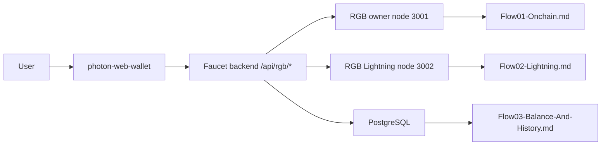

# Flow01: PHOTON Transfer Flow Index

This folder now splits the PHOTON asset flow into three focused documents based on the current code in:

- `photon-web-wallet/src/App.tsx`
- `photon-web-wallet/src/utils/rgb-wallet.ts`
- `faucet/server.js`

It does not rely on `AGENTS.md`.

## Documents

1. `Flow01-Onchain.md`
   RGB invoice creation and RGB on-chain PHO send flow.

2. `Flow02-Lightning.md`
   Lightning invoice creation and Lightning PHO payment flow.

3. `Flow03-Balance-And-History.md`
   Wallet identity, transfer ownership filtering, balance derivation, refresh flow, and history rendering.

## Architecture Summary

The code shows this path:

1. `photon-web-wallet` UI
2. Faucet backend API under `/api/rgb/*`
3. RGB owner node or RGB Lightning node
4. PostgreSQL persistence
5. Result returned to the wallet

## Quick Diagram

