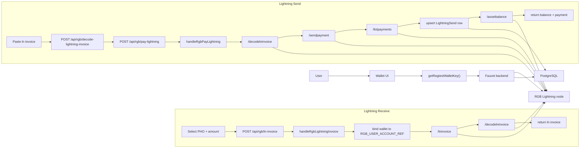

# Flow02-Lightning: PHOTON Lightning Flow From Code

This document is based on:

- `photon-web-wallet/src/App.tsx`
- `photon-web-wallet/src/utils/rgb-wallet.ts`
- `faucet/server.js`

## Components Used In This Flow

1. `photon-web-wallet`
   Creates Lightning RGB invoices, decodes Lightning invoices, pays them, and refreshes balances.

2. Faucet backend
   Handles:
   - `POST /api/rgb/ln-invoice`
   - `POST /api/rgb/decode-lightning-invoice`
   - `POST /api/rgb/pay-lightning`
   - `POST /api/rgb/refresh`

3. RGB Lightning node
   Used for:
   - `/lninvoice`
   - `/decodelninvoice`
   - `/sendpayment`
   - `/listpayments`
   - `/assetbalance`

4. PostgreSQL
   Stores wallet-scoped Lightning transfer rows and balance snapshots.

## Shared Setup

1. The wallet builds a backend wallet key with `getRegtestWalletKey()`.
2. It sends that key in `x-photon-wallet-key`.
3. The backend resolves that to a wallet row with `ensureWallet(...)`.
4. For Lightning invoice creation, the backend forces the wallet account ref to `RGB_USER_ACCOUNT_REF`.
5. `resolveWalletNodeContext(...)` then points the wallet to the Lightning node API base.

## Flow A: Receive PHO Through A Lightning Invoice

1. The user opens `Receive Instantly`.
2. The wallet resolves the selected PHO asset to its RGB contract id.
3. The wallet calls `createRegtestLightningInvoice(...)`.
4. The wallet sends `POST /api/rgb/ln-invoice` with:
   - `assetId`
   - `amount`
   - optional `expirySec`
   - optional `amtMsat`
   - header `x-photon-wallet-key`
5. The backend handler `handleRgbLightningInvoice` validates the request.
6. The backend calls `ensureWallet(...)`.
7. The backend sets `wallet.rgb_account_ref = RGB_USER_ACCOUNT_REF`.
8. The backend resolves the active node context to the Lightning node.
9. The backend calls `/lninvoice` with:
   - `expiry_sec`
   - `amt_msat`
   - `asset_id`
   - `asset_amount`
10. The backend immediately calls `/decodelninvoice` for the created invoice.
11. The backend returns:
   - `walletKey`
   - `invoice`
   - `decoded`
12. The wallet displays the Lightning invoice and QR code.

## Flow B: Send PHO Through A Lightning Payment

1. The user pastes an `ln...` invoice into the wallet send form.
2. The wallet calls `decodeRegtestLightningInvoice(...)`.
3. The wallet sends `POST /api/rgb/decode-lightning-invoice`.
4. The backend resolves the wallet node context and forwards the request to `/decodelninvoice`.
5. The decode response gives:
   - `asset_id`
   - `asset_amount`
   - `amt_msat`
   - `payment_hash`
6. The wallet sets send mode to `lightning`.
7. On confirmation, the wallet calls `payRegtestLightningInvoice(...)`.
8. The wallet sends `POST /api/rgb/pay-lightning` with:
   - `invoice`
   - header `x-photon-wallet-key`
9. The backend handler `handleRgbPayLightning` resolves wallet context.
10. The backend decodes the invoice again using `/decodelninvoice`.
11. The backend syncs the PHO asset into `wallet_assets`.
12. The backend calls `/sendpayment` on the Lightning node.
13. The backend calls `/listpayments`.
14. The backend finds the matching payment by `payment_hash`.
15. The backend writes or updates a transfer row through `upsertLightningPaymentTransfer(...)`.
16. That row is stored with:
   - `direction: outgoing`
   - `transfer_kind: LightningSend`
   - payment status
   - payment hash and invoice in metadata
17. The backend records a `transfer_events` row with `rgb_lightning_payment`.
18. The backend fetches live asset balance through `/assetbalance` on the Lightning node.
19. The backend stores the resulting balance in `wallet_asset_balances`.
20. The backend returns:
   - `balance`
   - payment summary
   - decoded invoice
21. The wallet updates local PHO balance state optimistically.
22. The wallet shows send success.

## Post-Payment Refresh

After Lightning send success, the wallet schedules a delayed refresh:

1. It mines one regtest block via `/regtest/mine`.
2. It calls `POST /api/rgb/refresh`.
3. The backend calls `/refreshtransfers` on the RGB owner node.
4. The wallet reloads assets.
5. The wallet reloads activities.

The Lightning balance shown to the wallet comes from the backend response and later refresh calls.

## Mermaid Diagram

