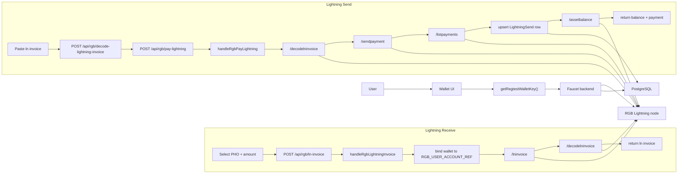

# Flow02-Lightning: PHOTON Lightning Flow From Code

This document is based on:

- `photon-web-wallet/src/App.tsx`
- `photon-web-wallet/src/utils/rgb-wallet.ts`
- `faucet/server.js`

## Components Used In This Flow

1. `photon-web-wallet`
   Creates Lightning RGB invoices, decodes Lightning invoices, pays them, and refreshes balances.

2. Faucet backend
   Handles:
   - `POST /api/rgb/ln-invoice`
   - `POST /api/rgb/decode-lightning-invoice`
   - `POST /api/rgb/pay-lightning`
   - `POST /api/rgb/refresh`

3. RGB Lightning node
   Used for:
   - `/lninvoice`
   - `/decodelninvoice`
   - `/sendpayment`
   - `/listpayments`
   - `/assetbalance`

4. PostgreSQL
   Stores wallet-scoped Lightning transfer rows and balance snapshots.

## Shared Setup

1. The wallet builds a backend wallet key with `getRegtestWalletKey()`.
2. It sends that key in `x-photon-wallet-key`.
3. The backend resolves that to a wallet row with `ensureWallet(...)`.
4. For Lightning invoice creation, the backend forces the wallet account ref to `RGB_USER_ACCOUNT_REF`.
5. `resolveWalletNodeContext(...)` then points the wallet to the Lightning node API base.

## Flow A: Receive PHO Through A Lightning Invoice

1. The user opens `Receive Instantly`.
2. The wallet resolves the selected PHO asset to its RGB contract id.
3. The wallet calls `createRegtestLightningInvoice(...)`.
4. The wallet sends `POST /api/rgb/ln-invoice` with:
   - `assetId`
   - `amount`
   - optional `expirySec`
   - optional `amtMsat`
   - header `x-photon-wallet-key`
5. The backend handler `handleRgbLightningInvoice` validates the request.
6. The backend calls `ensureWallet(...)`.
7. The backend sets `wallet.rgb_account_ref = RGB_USER_ACCOUNT_REF`.
8. The backend resolves the active node context to the Lightning node.
9. The backend calls `/lninvoice` with:
   - `expiry_sec`
   - `amt_msat`
   - `asset_id`
   - `asset_amount`
10. The backend immediately calls `/decodelninvoice` for the created invoice.
11. The backend returns:
   - `walletKey`
   - `invoice`
   - `decoded`
12. The wallet displays the Lightning invoice and QR code.

## Flow B: Send PHO Through A Lightning Payment

1. The user pastes an `ln...` invoice into the wallet send form.
2. The wallet calls `decodeRegtestLightningInvoice(...)`.
3. The wallet sends `POST /api/rgb/decode-lightning-invoice`.
4. The backend resolves the wallet node context and forwards the request to `/decodelninvoice`.
5. The decode response gives:
   - `asset_id`
   - `asset_amount`
   - `amt_msat`
   - `payment_hash`
6. The wallet sets send mode to `lightning`.
7. On confirmation, the wallet calls `payRegtestLightningInvoice(...)`.
8. The wallet sends `POST /api/rgb/pay-lightning` with:
   - `invoice`
   - header `x-photon-wallet-key`
9. The backend handler `handleRgbPayLightning` resolves wallet context.
10. The backend decodes the invoice again using `/decodelninvoice`.
11. The backend syncs the PHO asset into `wallet_assets`.
12. The backend calls `/sendpayment` on the Lightning node.
13. The backend calls `/listpayments`.
14. The backend finds the matching payment by `payment_hash`.
15. The backend writes or updates a transfer row through `upsertLightningPaymentTransfer(...)`.
16. That row is stored with:
   - `direction: outgoing`
   - `transfer_kind: LightningSend`
   - payment status
   - payment hash and invoice in metadata
17. The backend records a `transfer_events` row with `rgb_lightning_payment`.
18. The backend fetches live asset balance through `/assetbalance` on the Lightning node.
19. The backend stores the resulting balance in `wallet_asset_balances`.
20. The backend returns:
   - `balance`
   - payment summary
   - decoded invoice
21. The wallet updates local PHO balance state optimistically.
22. The wallet shows send success.

## Post-Payment Refresh

After Lightning send success, the wallet schedules a delayed refresh:

1. It mines one regtest block via `/regtest/mine`.
2. It calls `POST /api/rgb/refresh`.
3. The backend calls `/refreshtransfers` on the RGB owner node.
4. The wallet reloads assets.
5. The wallet reloads activities.

The Lightning balance shown to the wallet comes from the backend response and later refresh calls.

## Same-Node Wallets

If the sender wallet and receiver wallet are both assigned to the same RGB Lightning node account
ref, the payment should not use the normal Lightning path.

Why:

1. The receiver invoice is created on that node.
2. The sender payment is also attempted from that same node.
3. The backend currently detects that the decoded invoice `payee_pubkey` matches the sender node
   pubkey and rejects the payment as a self-transfer.

Recommended design:

1. Keep true Lightning only for wallet pairs that resolve to different node account refs.
2. Add a dedicated same-node wallet transfer path for wallet pairs that resolve to the same node
   account ref.
3. Treat that path as a backend-managed internal transfer, not as an RGB Lightning payment.

### Same-Node Wallet Transfer Plan

1. Invoice creation:
   - The receiver still calls `POST /api/rgb/ln-invoice`.
   - The backend stores the invoice together with the receiver wallet id and resolved node account
     ref.
   - The invoice remains the receiver-facing request object, but it is marked as eligible for
     same-node resolution if the payer later resolves to the same node.

2. Preflight on send:
   - The sender still pastes the invoice into the send form.
   - The backend decodes the invoice using the sender wallet context.
   - The backend resolves:
     - sender wallet id
     - sender account ref
     - receiver wallet id for the stored invoice
     - receiver account ref
   - If sender and receiver account refs are different, continue with normal
     `POST /api/rgb/pay-lightning`.
   - If sender and receiver account refs are the same, switch to the same-node wallet transfer
     flow.

3. Validation rules:
   - The invoice must exist in backend storage.
   - The invoice must still be open and unused.
   - The asset id and asset amount must match the decoded invoice.
   - Sender and receiver wallet ids must be different.
   - Both wallets must resolve to the same RGB node account ref.
   - Sender wallet must have sufficient spendable or off-chain outbound balance for that asset.

4. Execution:
   - Do not call `/sendpayment`.
   - Create an outgoing transfer row for the sender wallet.
   - Create an incoming transfer row for the receiver wallet.
   - Link both rows through a shared correlation id such as `same_node_transfer_id`.
   - Mark metadata with:
     - `route: internal_same_node`
     - `transfer_kind: SameNodeWalletTransfer`
     - `node_account_ref`
     - `invoice`
     - `payment_hash` if available from the decoded invoice, otherwise `null`
   - Record append-only `transfer_events` rows for creation, acceptance, settlement, and failure.

5. Balance reconciliation:
   - Recompute sender and receiver wallet-scoped asset balances immediately after creating the
     linked transfer rows.
   - Preserve the existing refresh pipeline so later node sync still reconciles backend state
     against node state.
   - If node runtime data later disagrees with the internal transfer rows, surface that as a
     reconciliation error rather than silently mutating history.

6. UI behavior:
   - Show a distinct route label such as `Same-node transfer`.
   - Do not tell the user that the payment used Lightning.
   - Show the transfer in activity history as instant but internal.

### Backend Changes

1. Add an invoice lookup helper that resolves the stored invoice owner wallet and account ref.
2. Add a preflight branch in the send flow before calling `/sendpayment`.
3. Add a new execution helper such as `executeSameNodeWalletTransfer(...)`.
4. Add a dedicated transfer kind and route metadata.
5. Add idempotency protection so replaying the same invoice does not create duplicate internal
   transfers.

### Database Changes

1. Extend `rgb_invoices` or related invoice storage so Lightning invoices can be mapped back to the
   receiver wallet that created them.
2. Add a correlation column on `rgb_transfers`, for example `same_node_transfer_id`.
3. Add settlement and audit events in `transfer_events`.
4. Optionally add a dedicated `same_node_transfers` table if the team wants an explicit workflow
   object instead of only linked transfer rows.

## Mermaid Diagram

