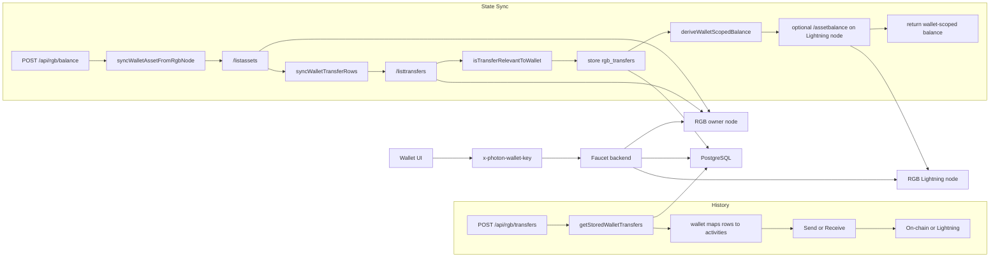

# Flow03-Balance-And-History: PHOTON Wallet State From Code

This document is based on:

- `photon-web-wallet/src/App.tsx`
- `photon-web-wallet/src/utils/rgb-wallet.ts`
- `faucet/server.js`

## Purpose

This document explains how the current code:

1. scopes PHO state to a wallet
2. decides which transfers belong to that wallet
3. derives PHO balances
4. refreshes state
5. renders sent and received history

## Wallet Identity

The wallet uses a backend-scoped key, not a direct RGB node session.

1. `App.tsx` builds a regtest wallet key with `getRegtestWalletKey()`.
2. The format is `extension-${stableId}-regtest`.
3. `stableId` comes from:
   - `principalId`
   - or `walletAddress`
   - or `coloredAddress`
   - or `anonymous`
4. The wallet sends this in `x-photon-wallet-key`.
5. The backend uses `ensureWallet(...)` to resolve or create a wallet row.

## How The Backend Syncs An Asset

For PHO balance or transfer reads:

1. The wallet calls:
   - `POST /api/rgb/balance`
   - or `POST /api/rgb/transfers`
2. The backend calls `syncWalletAssetFromRgbNode(...)`.
3. That fetches `/listassets` from the owner RGB node.
4. It finds the asset by RGB `asset_id`.
5. It upserts the asset into `wallet_assets`.

## How The Backend Decides Which Transfers Belong To The Wallet

The backend uses `syncWalletTransferRows(...)`.

That function:

1. fetches `/listtransfers` from the owner RGB node
2. computes wallet ownership hints from:
   - `rgb_invoices`
   - `transfer_events`
3. filters transfers through `isTransferRelevantToWallet(...)`

The relevance rules are:

1. `Issuance`
   Belongs only to the owner wallet.

2. `Receive*`
   Belongs to the wallet if:
   - the `recipient_id` matches a stored wallet invoice recipient id, or
   - the transfer idx matches a stored invoice batch transfer idx

3. `Send`
   Belongs to the wallet if:
   - the wallet is the owner wallet, or
   - the `recipient_id` matches a previously recorded `rgb_send_requested` event

Lightning transfers are different:

1. They are not pulled from `/listtransfers`.
2. They are inserted directly by `upsertLightningPaymentTransfer(...)`.
3. They are stored with transfer kinds like `LightningSend` or `LightningReceive`.

## How Transfer Rows Are Stored

The backend stores transfer rows in `rgb_transfers` with fields such as:

- `direction`
- `transfer_kind`
- `status`
- `txid`
- `recipient_id`
- `requested_assignment_value`
- `settled_amount`
- `created_at`
- `updated_at`
- `settled_at`
- `metadata`

The backend later exposes those rows to the wallet through `getStoredWalletTransfers(...)`.

## How Balance Is Derived

The backend has two balance paths.

### 1. Derived transfer-based balance

`deriveWalletScopedBalance(...)` reads `rgb_transfers` and computes:

- `settled`
- `future`
- `spendable`
- `offchain_outbound`
- `offchain_inbound`
- `locked_missing_secret`
- `locked_unconfirmed`
- `spendability_status`

Core behavior:

1. Settled incoming transfers can increase `settled`.
2. Spendability depends on secret availability and confirmation count.
3. Settled outgoing transfers reduce `settled` and `spendable`.
4. Pending incoming transfers contribute to `offchain_inbound`.
5. Pending outgoing transfers contribute to `offchain_outbound`.

### 2. Live Lightning balance

If the wallet has an RGB account reference:

1. The backend calls `/assetbalance` on the Lightning node.
2. That live response can override the derived balance returned to the wallet.

This is why the wallet can show instant-send and instant-receive liquidity separately from on-chain PHO.

## How The Wallet Refreshes PHO State

The wallet refreshes PHO state in several places:

1. On asset sync:
   It calls `fetchRegtestRgbBalance(...)`.

2. On activities load:
   It calls `fetchRegtestRgbTransfers(...)`.

3. After Lightning payment:
   It:
   - mines one regtest block
   - calls `refreshRegtestRgbTransfers(...)`
   - reloads assets
   - reloads activities

4. After RGB send:
   It refreshes wallet balance and UTXO views.

## How Sent And Received History Is Built In The Wallet

The wallet activities tab combines:

1. BTC activity from `fetchBtcActivities(...)`
2. RGB activity from `fetchRegtestRgbTransfers(...)`

For RGB activities:

1. The wallet calls `POST /api/rgb/transfers`.
2. The backend returns wallet-scoped transfer rows and balance.
3. The wallet maps each transfer into a UI activity.

The wallet now uses:

1. `direction`
2. `kind`
3. `route`
4. backend timestamps:
   - `settled_at`
   - `updated_at`
   - `created_at`

That mapping produces:

1. `Send` or `Receive`
2. route:
   - `onchain`
   - `lightning`
3. status:
   - `Pending`
   - `Confirmed`

For Lightning rows, the UI renders:

1. `Send Instantly`
2. `Receive Instantly`

instead of a generic Lightning label.

## Important Architectural Fact

The browser extension does not own the RGB runtime directly.

The active state path is:

1. wallet UI request
2. backend wallet resolution
3. RGB node or Lightning node request
4. PostgreSQL persistence
5. backend-computed balance and transfer response
6. wallet rendering

## Mermaid Diagram

